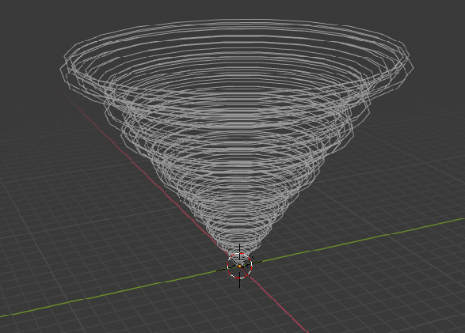

## Generative art in Blender 2.8
Some completed and in-progress functions for generative art in Blender using Grease Pencil.

### Setup
Open Blender and paste the contents of paste-into-blender-text-editor.py into the text editor in Blender's scripting workspace.

The script tracks changes in the art.py and perlin.py files so that you can develop from your own text editor instead of using Blender's text editor.

However you still need to focus on Blender's text editor and use `alt-p` to run the updated code.

### Generative tornadoes
Tornado with applied [Perlin noise](https://en.wikipedia.org/wiki/Perlin_noise)

Arrays of tornadoes with Perlin noise

